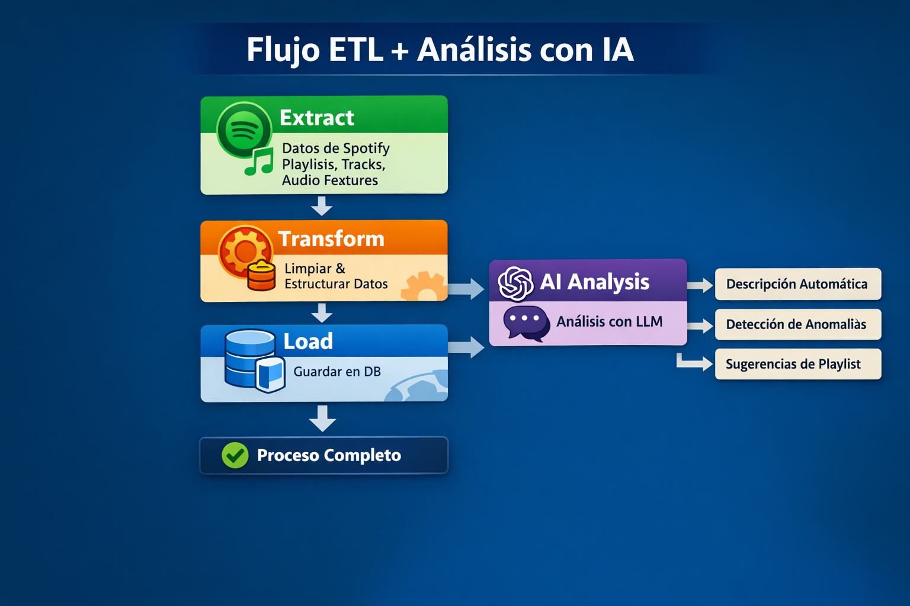

# Spotify ETL Pipeline integración con la AI


## 📋 Descripción del Proyecto

Este proyecto implementa un **sistema completo de procesamiento ETL** (Extract, Transform, Load) que extrae datos de la API de Spotify, los transforma y limpia, y los carga en una base de datos estructurada. Como valor añadido, integra un **LLM (Large Language Model) de OpenAI** para generar análisis automáticos y detección de anomalías en los datos musicales.

### 🎯 Características principales

- **Extract**: Conexión a la API de Spotify para obtener datos de playlists, canciones, artistas y características de audio.
- **Transform**: Limpieza, normalización y enriquecimiento de datos (duración, popularidad, features de audio).
- **Load**: Almacenamiento persistente en base de datos SQLite.
- **AI Integration**: Uso de OpenAI GPT para:
  - Generar descripciones automáticas de las playlists cargadas.
  - Detectar anomalías o inconsistencias en los datos (ej: duraciones extremas, valores atípicos en popularidad).
  - Explicar patrones interesantes en lenguaje natural.

## 🏗️ Estructura del Proyecto
```
spotify-etl-ai/
│── connection/               # Módulos de conexión a APIs
│   ├── openAIConnection.py   # Conexión con OpenAI API
│   └── spotifyAPIConnection.py # Conexión con Spotify API
│
│── db/                       # Gestión de base de datos
│   └── createTable.py        # Script para creación de tablas
│
│── etl/                      # Procesos ETL
│   ├── extract.py            # Extracción de datos desde Spotify
│   ├── transform.py          # Transformación y limpieza de datos
│   └── load.py               # Carga en base de datos
│
│── llm/                      # Integración con modelos de lenguaje
│   └── spotifyAnalytics.py   # Análisis y enriquecimiento con LLM
│
├── cfg.py                    # Configuración del proyecto
├── main.py                   # Punto de entrada principal
├── requirements.txt          # Dependencias del proyecto
├── .env.production           # Variables entorno (producción) 
└── READ.me                   # Documentación auxiliar
```

## 🚀 Requisitos Previos

- Python 3.10 o superior
- Cuenta de [Spotify](https://open.spotify.com/)
- Cuenta de desarrollador en [Spotify Developer Dashboard](https://developer.spotify.com/dashboard/)
- Cuenta en [OpenAI Platform](https://platform.openai.com/) con créditos o suscripción
- Pip y virtualenv (recomendado)

## 🔧 Instalación

```bash
1. Clonar el repositorio

git clone https://github.com/lialeiva/spotify-etl-ai.git
cd spotify-etl-ai

2. Crear y activar entorno virtual

python -m venv venv
# En Windows:
venv\Scripts\activate
# En macOS/Linux:
source venv/bin/activate

3. Instalar dependencias

pip install -r requirements.txt

4. Crear la base de datos
Cree una base de datos en postgres con el nombre que desee, puede crear un usuario con privilegios de administración y ponerlo como propietario de la base de datos que creó.


5. Configurar variables de entorno
Crea un archivo .env.local (para desarrollo) en la raíz del proyecto con el siguiente contenido o realiza una copia desde env.production:

OPENAI_API_KEY=
SPOTIFY_CLIENT_ID=
SPOTIFY_CLIENT_SECRET=
SPOTIFY_REDIRECT_URI=https://google.com

DB_USER=usuario propietario de la base de datos creada
DB_PASSWORD=password del db_user
DB_HOST=
DB_PORT=5432
DB_NAME=nombre de la bd creada
```

💻 Uso del Proyecto
Ejecutar el pipeline ETL completo

python main.py

Esto ejecutará secuencialmente:

- **Extract**: Obtiene datos de Spotify (played_at, artist, tracks, url).
- **Transform**: Limpia y estructura los datos.
- **Load**: Guarda los datos en la base de datos.
- **AI Analysis**: Llama a OpenAI para generar insights.

## 🖥️ Ejemplo de salida

Así verá las salidas al ejecutar el pipeline ETL:

```bash
🚀 Starting pipeline ETL...
📅 Processing data from: 2026-04-12 09:26:01

📥 STEP 1: EXTRACT
✅ Extracted 40 registers

📥 STEP 2: TRANSFORM
🔄 Transforming data...
✅ Transformed 40 registers

       played_at               artist                                             track                                                                 url                          
2026-04-13T05:18:50.052Z      Avril Lavigne                                                                        Complicated https://open.spotify.com/artist/0p4nmQO2msCgU4IF37Wi3j
2026-04-13T05:14:19.643Z       Benson Boone                                                                   Beautiful Things https://open.spotify.com/artist/22wbnEMDvgVIAGdFeek6ET
... (more rows) ...

💾 STEP 3: LOAD
ℹ️ Table 'spotify_recently_playlist' already exists, no creation needed
   ✅ Loaded 40 registers

🎉 Pipeline ETL completed successfully ✅
📊 Total records: 40

🤖 STEP 4 LLM: GENERATE AN ANALYSIS OF THE PLAYLIST


😊 Analyze mood:
Overall, the mood reads as emotionally charged and catchy...

😊 General description:
Your playlist points to...

💿 Suggest playlist name:
1. **Golden Hopes & Neon Demons**  
2. **Idols After Dark (Pop, Pulse & Power)**  
3. **Soda Pop Anthems & Monster Choruses**  
4. **Faded but Fearless: High-Voltage Hits**  
5. **Misfits on the Mainstage (Sing It Loud Edition)**

🤪 Obsessions:
Playing “Golden” 8 times isn’t obsession—it’s **quality control**. You’re basically a one-person 
streaming committee ensuring the song remains properly golden. Possible diagnoses:  
1) You’re **in a good mood** and refuse to let reality interrupt it.  
2) You’re **in a weird mood** and the chorus is your emotional support blanket.  
3) You’re **romanticizing your life** like you’re walking in slow motion to a movie soundtrack
```

## 📊 Diagrama de flujo ETL + LLM resumido




